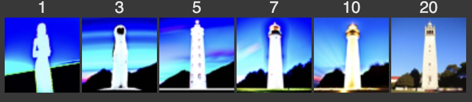
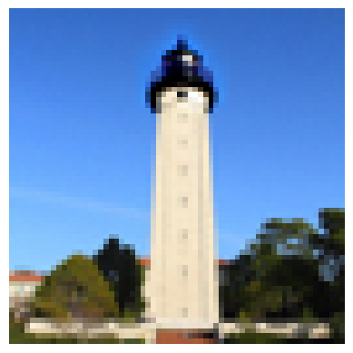
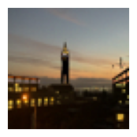
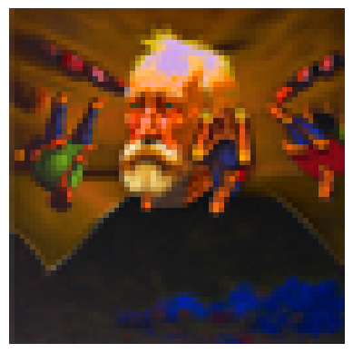

# Project5 **The Power of Diffusion Models**

## **Part A of a Larger Project**

### **Overview**

In Part A of this project, we explore the capabilities of diffusion models. We implement diffusion sampling loops and apply them to tasks such as inpainting and creating optical illusions. 

### **Part 1: Sampling Loops**

#### **1.1 Implementing the Forward Process**

**Test Image at Noise Levels [250, 500, 750]**

#### **1.2 Classical Denoising**

For each noisy image, we applied Gaussian blur to attempt denoising.

#### **1.3 One-Step Denoising**

Using the UNet model to estimate and remove noise.

#### **1.4 Iterative Denoising**

**Denoising Process (Every 5th Image)**

**Comparison with One-Step Denoising and Gaussian Blurring**

​	•	*One-Step Denoised Image*

​	•	*Gaussian Blurred Image*

#### **1.5 Diffusion Model Sampling**

We generated images from random noise using the iterative denoising process.

**Sampled Images**

#### **1.6 Classifier-Free Guidance (CFG)**

**Generated Images with CFG Scale = 7**

#### **1.7 Image-to-image Translation**

We applied the iterative denoising process to noisy versions of images.

**Edits of Test Image at Noise Levels [1, 3, 5, 7, 10, 20]**

**Edits of Own Test Images**

##### **1.7.1 Editing Hand-Drawn and Web Images**

##### **1.7.2 Inpainting**

**Inpainted Test Image**

**Own Images Edited**

*Image 1*

​	•	*Original*

​	•	*Mask*

​	•	*Inpainted*

​		If we reverse the mask:

*Image 2*

​	•	*Original*

​	•	*Mask*

​	•	*Inpainted*

##### **1.7.3 Text-Conditional Image-to-image Translation**

**Edits of Test Image with Given Prompt**

**Edits of Own Test Images**

​	•	*Image 1*

​	•	*Image 2*

#### **1.8 Visual Anagrams**

**Visual Anagram: “Old Man” and “People Around a Campfire”**

**Additional Illusions**

​	•	*Illusion 1*: ["a lithograph of waterfalls"], ["a photo of a man"]

​	•	*Image*

​	•	*Flipped*

​	•	*Illusion 2*: ["a photo of the amalfi cost"], ["a photo of a dog"]

​	•	*Image*

​	•	*Flipped*

#### **1.9 Hybrid Images**

**Hybrid Image: “Skull” and “Waterfall”**

​	•	*Resulting Image*

**Additional Hybrid Images**

​	•	*Hybrid Image 1*': a lithograph of a forest scene', 'a lithograph of hulk's face'

​	•	*Hybrid Image 2*: 'a lithograph of a skull', 'an oil painting of a snowy mountain village'

#### **Conclusion**

In this project, we explored the capabilities of diffusion models through various implementations and applications. We observed how iterative denoising improves image quality over single-step methods, and how techniques like CFG enhance the results further. By experimenting with image translation, inpainting, visual anagrams, and hybrid images, we demonstrated the versatility and power of diffusion models in generating and manipulating images.

